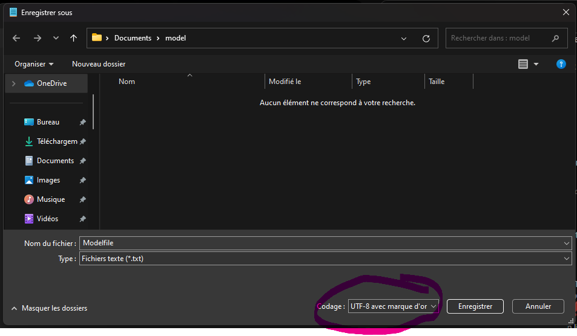

[Lien FR](https://github.com/Dymerz/StarCitizen-Localization/raw/refs/heads/main/data/Localization/french_(france)/global.ini)

[user.cfg](/user.cfg)

### Installation manuelle
- Télécharger les fichiers du répertoire avec le bouton vert `Code` en haut à droite.
- Extraire le language désiré dans le dossier `\PATH\TO\GAME\Robert Space Industries\StarCitizen\LIVE\data\Localization`
- Créer un fichier `user.cfg` (activé les extensions des fichiers dans les paramètres de Windows) dans le dossier `C:\PATH\TO\GAME\Robert Space Industries\StarCitizen\LIVE` si vous en avez pas déjà un.
- Dans le fichier `user.cfg` ajouter une ligne `g_language=` puis ajouter le language désiré après le `=`, exemple : `g_language=french_(france)`
- Enregistrer le fichier puis vous pourrez démarrer le jeu.

:warning: - **Avec cette méthode il se peut que la traduction ne fonctionne pas, pour résoudre le soucis il faut réencoder le fichier `global.ini` en `UTF8 with BOM` avec un logiciel type Notepad++.**

