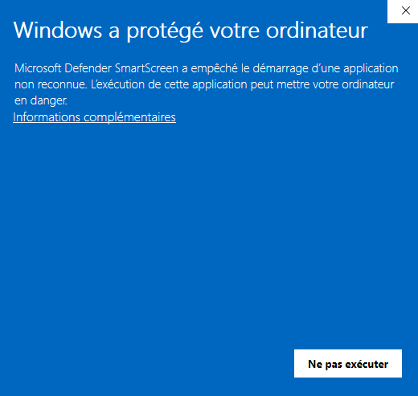
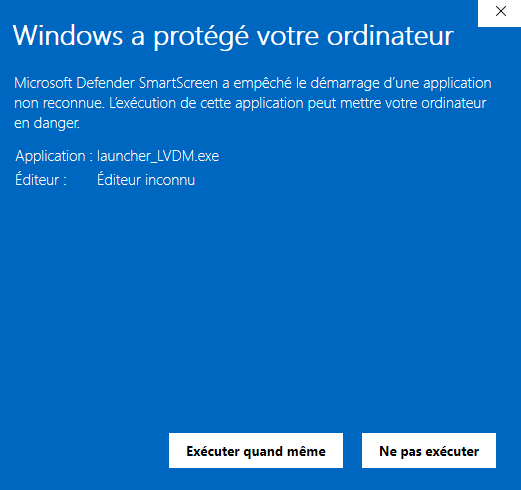
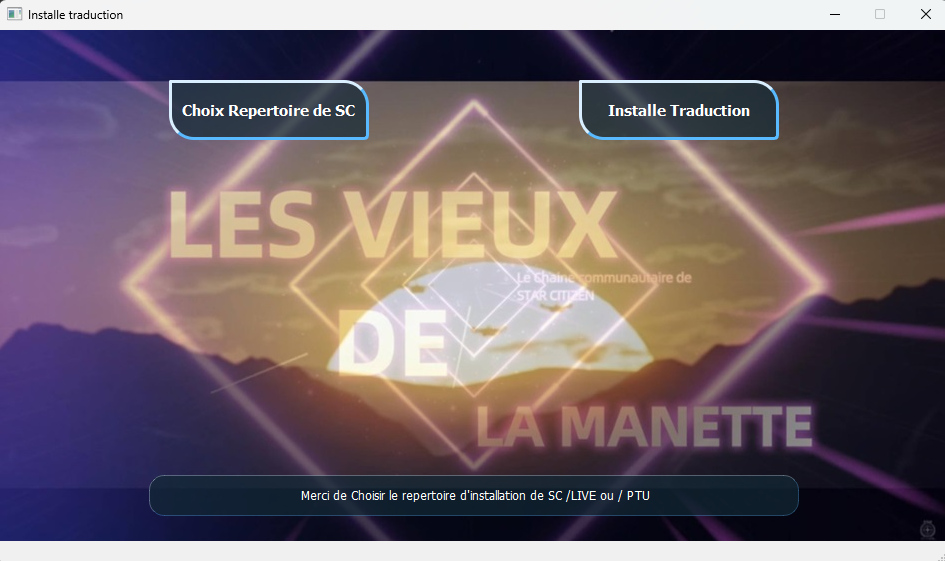

# Launcher LVDM

Comment mettre Star Citizen en français ? (Guide complet)

## Table des matières

- [Introduction](#introduction)
- [Installation](#installation)
- [Utilisation](#utilisation)
- [Contributer](#contributer)


## Introduction

Star Citizen, le célèbre simulateur spatial de Cloud Imperium Games, est très apprécié pour son immersion et son gameplay complexe. Pour les joueurs francophones, il peut être plus confortable d’y jouer en français. Dans ce guide, nous allons vous expliquer étape par étape comment changer la langue du jeu en français.

## Installation

1. Telecharger l'executable
   
   [Launcher_LVDM.exe](https://github.com/zellio22/launcher_trad_zellio/raw/refs/heads/main/launcher/launcher_LVDM.exe)

## Utilisation

  Double-cliquez sur le fichier téléchargé.
  Un message bleu va apparaître..
      
  

  Faites “information complémentaire” et “Exécuter quand même“

  

  Choisissez votre répertoire de destination en haut à gauche.

  

  En général le chemin est : ```C:/Programmes/Roberts Space Industrie/Star Citizen/Live``` ou PTU si vous souhaitez l’installer aussi dans la PTU.
  <span style="color: red; font-weight: bold;">IMPORTANT, cliquez une fois sur le répertoire de destination, NE L’OUVREZ PAS</span>
  Puis faites “installe traduction” à droite.
      
  
## Contributer

Cette traduction provient de “https://sctranslator.danidomen.com/edit/fr/global” un grand merci à eux. Nous avons juste mis un launcher en place pour vous faciliter l’installation.

## Autre solution pour insttaler la traduction 
  1.  [Manuellement](MANU.md)
  2.   [Execution avec Python](PYTHON.md)
